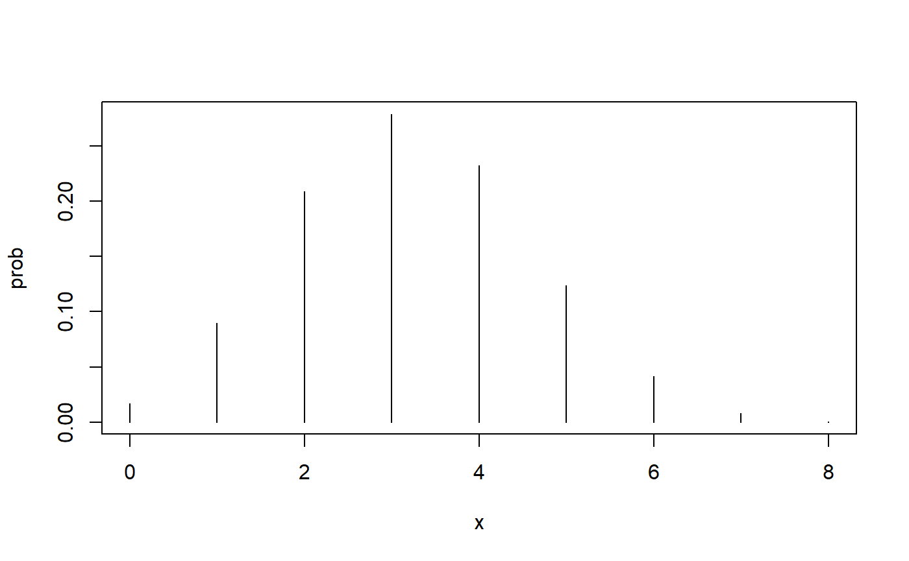

<!-- README.md is generated from README.Rmd. Please edit that file -->

# nplearn

<!-- badges: start -->

<!-- badges: end -->

The goal of nplearn is to provide students and instructors of
nonparametric statistics some functions that will facilitate learning
the conceptual underpinnings of nonparametric statistics. This package
also provides vignettes to exemplify concepts.

## Installation

You can install the development version from [GitHub](https://github.com/) with:

``` r
# install.packages("devtools")
devtools::install_github("fourthz/nplearn")
```

## Example

This is a basic example which shows you how to solve a common problem:

``` r
library(nplearn)
## a binomial probability density plot
binom_plot(8, .4)
```


