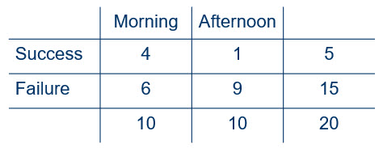
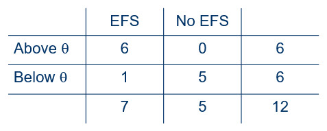

```{r, include = FALSE}
knitr::opts_chunk$set(
  collapse = TRUE,
  comment = "#>"
)
```

When we have two independent samples and a dichotomous response variable, our 
interest is in the probability of a joint event in which there are some number 
of successes in one sample and some number of successes in the other sample. 
Other than the sample size, there is no restriction on how many successes can 
occur in each sample. In some situations, however, the total number of 
successes is known in advance. In that case,  the number of successes in our 
two conditions are dependent on one another. Knowing the number of successes in 
one condition will tell us the number in the other condition. In this vignette, 
we turn our attention to analyzing data when the number of successes is known 
prior to the start of the study.

### Required packages

The packages required for this vignette are nplearn and MASS. Make certain that 
you have installed these packages before attempting to load the libraries.

```{r setup}
library(nplearn)
library(MASS)
```

### The hypergeometric distribution

In the *product binomial* vignette, we analyzed data obtained from two samples 
created by randomizing 20 band students to morning and afternoon tryouts for 
the all-state band. Let's again consider this scenario, but this time suppose 
that these students all come from one school. The all-state band committee has 
indicated how many students can be accepted from each school, based on school 
size. For this school, only five slots can be filled by band members from the 
school.

Here are the (hypothetical) data.



As in the previous example, 20 students were randomly assigned to morning and 
afternoon tryout conditions. The difference this time is that we know before 
the tryouts even begin that there will be 5 successes. Notice that with this 
knowledge we can fill in every margin in our table before we ever collect the 
data. This is clearly not a product binomial problem because the number of 
possible successes do not vary from 0 to 10 for each condition. The highest 
number of successes that can occur in a condition is 5. Further, the number 
of successes that can occur in the other condition is directly related to how 
many there are in the first condition so that the numbers of successes must sum 
to 5.

We can conceive of the possibilities by focusing on just one cell in this four 
cell crossbreak table. Let's focus on the upper left cell (morning successes). 
This can range from 0 to 5 successes. Notice that whatever value we set this 
cell to be in that range, the entire table can be completed. We already know 
that we cannot calculate the probability of this table with the product 
binomial formula, so what do we do?

The answer is that under the null hypothesis of equal proportions of successes 
in both morning and afternoon conditions, the probability of a particular value 
of $\hat{\delta}$ is given by the hypergeometric formula. We can use a function 
in R to make this calculation. For example, for our oberved data in Figure 1, 
here is the probability calculation.

```{r}
dhyper(4, 10, 10, 5)
```

The entry of values is for obtaining the probability of randomly selecting 4 
morning students out of 10 morning students when we also have 10 afternoon 
students and there will be 5 slots to fill.

Realizing that number of morning successes can only range from 0 to 5, and 
also knowing that the remainder of the success will be in the afternoon, we 
can create the entire probability distribution.

```{r}
morning.success <- 0:5
afternoon.success <- 5 - morning.success
delta.hat <- morning.success/10 - afternoon.success/10
prob <- dhyper(morning.success, 10, 10, 5)
cbind(morning.success, afternoon.success, delta.hat, prob)
```

Here's a check that these probabilities sum to 1.

```{r}
sum(prob)
```

Suppose we are looking for judging bias in either direction (i.e. favoring 
either the morning or afternoon). Then we need to obtain our *p* value we need 
to add up all the probabilities for absolute values of $\hat{\delta}$ that are 
at least as great as our observed value of 0.3.

```{r}
sum(prob[abs(delta.hat) >= 0.3])
```

Clearly this is insufficient evidence to make claims of judging bias. If we had 
set out to study whether there is bias in favor of morning sessions, we would 
have just looked at one side of the distribution.

```{r}
sum(prob[delta.hat >= 0.3])
```

This still is probably not enough evidence for us to make bias accusations, 
even though we did find that 40% of the morning students and only 10% of the 
afternoon students were selected. The sample size is simply not large enough 
for us to claim bias, even with this estimate of time-of-day effect.

### A test for median equality

When the response variable for a single sample yields quantitative data, we can 
use the sign test as a test of a hypothesis about the median. Similarly, the 
Fisher-Irwin test can be used as a test of a hypothesis about the equality of 
two medians.

To exemplify this method, consider an example in which an independent 
evaluation firm interviews employees at 12 companies and then, based on the 
results of the interview, gives each company an "employee satisfaction score." 
Some of these companies have put an employee feedback system (EFS) in place as 
a means for employees to communicate concerns to management. The primary 
question is whether companies with such systems have higher satisfaction scores 
than those without such systems. We can view these companies as representing 
a larger population of companies, some of which have EFS and some which do not. 
Our interest is in whether the median satisfaction score is greater for 
companies with feedback systems than for companies that have not implemented 
such a system. Let's input the scores for this hypothetical example.

```{r}
efs <- c(8, 5, 8, 10, 9, 10, 11)
no.efs <- c(4, 7, 7, 4, 5)
```

Here are the null and alternative hypotheses.

$H_0: \theta_{efs} = \theta_{no \: efs}$

$H_a: \theta_{efs} > \theta_{no \: efs}$

If the null hypothesis is true, the two types of companies share the same 
median, so to estimate this common median we can combine all scores.

```{r}
all.companies <- c(efs, no.efs)
median(all.companies)
```

Let us now look at how many companies are above the median in each of the two 
conditions.

```{r}
sum(efs > 7.5)
sum(no.efs > 7.5)
```

With this information in hand, we can construct the following table.



As with the previous Fisher-Irwin example, all margin totals are known before 
the interviews are conducted and the companies are scored. We know which of the 
the companies have EFS in place, so the two sample sizes are known. The fact 
that we have hypothesized a common median tells us that half of the companies 
will be above the median and half will be below the median, so this margin is 
known as well. We can think of being above the median as a "success" and being 
below as a "failure," so this is the same type of situation as we had in the 
Fisher-Irwin example, so we can use the hypergeometric distribution.

```{r}
efs.above <- 1:6
no.efs.above <- 6 - efs.above
delta.hat <- efs.above/7 - no.efs.above/5
prob <- dhyper(efs.above, 7, 5, 6)
cbind(efs.above, no.efs.above, delta.hat, prob)
```

This is a one-sided test, so we can see that for the observed difference in 
proportions of 0.86, the *p* value is 0.0076. We can declare that EFS makes a 
difference in employee satisfaction, though there is a caveat: the data are 
from an observational study, rather than from an experiment. Extraneous 
variables may be responsible for the satisfaction differences. For example, 
suppose that the same companies that care enough about employee opinion to 
solicit feedback are also the companies that care enough to implement other 
employee-focused initiatives, such as break facility improvements or bonus 
incentives. These may be responsible for the difference, rather than the EFS.

Instead of looking at the full distribution, we can use a function that is 
available in R.

```{r}
efs.table <- matrix(c(6, 0, 1, 5),
                    nrow = 2,
                    byrow = TRUE)

fisher.test(efs.table, alternative = "greater")
```

We observe that the *p* value matches what we calculated earlier. We also 
notice a confidence interval for the "odds ratio," so now would be a good time 
to learn about this statistic.

### The odds ratio

In the previous example, the estimated proportion of EFS companies that are 
above the median company satisfaction score is 6/7, or 0.86. For the non-EFS 
companies it is 0/5, or 0. The odds of a specified outcome is the ratio of 
the expected frequency of that outcome to that of another outcome. In the 
current example, this would be the expected frequency of a company being above 
the median to that of being below the median. Obviously we don't know this 
expected frequency. It is a population value. What we do know, however are the 
observed frequencies, so we can use these to estimate the population values.

The odds of an EFS company being above the median are estimated to be 6 to 1, 
because 6 companies are above the median and 1 is below. If we consider this 
as a ratio, this is 6/1, or 6. This means that there is a six times greater 
chance for an EFS company being above the median than below the median.

Estimating the odds for a non-EFS company gives us a peculiar result: It is 0 
to 5, or 0/5, or 0. Stating that there is a "0 times greater chance" of being 
above the median than below the median is likely due to the small sample size. 
We would assume that with a larger number of companies, we would find some of 
them above the median satisfaction score, even if they had not implemented a 
feedback system.

The ratio of the odds, better known as the *odds ratio* is quite simply a ratio 
of these two odds. In the current example, we have (6/1)/(0/5). Again, we get a 
peculiar result due to the small sample size: 6/0. Dividing a number by 0 gives 
us an infinite result, which is why the odds ratio reported by the function 
above is listed as "inf". Even with this peculiar result, the confidence 
interval for the odds ratio was calculated as 2.4 to infinity. This means we 
are 95% confident that for the population of companies, implementation of an 
EFS makes it between 2.4 times to "infinite times" more likely to result in 
a satisfaction score that is above the median satisfaction score of all 
companies.

Let's do this again with the band data so that we can see an example without 
the peculiarity of having "infinite" in our results. Remember that this was a 
two-sided test because we were looking for judging bias in either direction.

```{r}
morning.odds <- 4/6
afternoon.odds <- 1/9
odds.ratio <- morning.odds/afternoon.odds
odds.ratio
```

This tells us that based on our observed data, we estimate that the chance of 
being selected for the all-state band is 6 times greater if you are judged in 
the morning than if you are judged in the afternoon. This is substantial, but 
remember that with the small sample size, this was not enough evidence to 
conclude that this is judging bias. Let's look at it with the R function.

```{r}
band.table <- matrix(c(4, 1, 6, 9),
                     nrow = 2,
                     byrow = TRUE)

fisher.test(band.table)
```

You may notice that the estimate of the odds ratio, about 5.5, is different 
than the odds ratio that we obtained of 6. Why? The sample odds ratio (our 
simple calculation above) can be calculated regardless of the number of 
marginal values that are fixed. That is, it does not "know" that we specified 
that there are only 5 slots available for the all-state band. If the judges 
changed it to be 6 slots, we would still get the same estimate (6) of the odds 
ratio. Yet how can this be? If there are fewer slots, the odds should change! 
The way to deal with this is to calculate an odds ratio that is conditioned on 
our fixed margins. Showing how to do this "by hand" is beyond what were we are 
going to go, but that's OK because the R function is doing exactly that for us. 
The estimate it reports is actually a better estimate than the simple one we 
calculated above, so we just need to focus on interpretation. The chance of 
success in a morning slot is about 5.5 times the chance of success in an 
afternoon slot.

Look at the confidence interval. It ranges from saying that the chance of 
success in the morning is less than half the chance of success in the afternoon 
all the way to the chance in the morning being 327 times the chance of success 
in the afternoon! This huge interval is consistent with our large *p* value. 
Clearly we could benefit from a larger sample.
