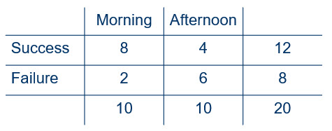

```{r, include = FALSE}
knitr::opts_chunk$set(
  collapse = TRUE,
  comment = "#>"
)
```

In this vignette we will consider the comparison of two populations on a 
dichotomous response variable. We analyzed a dichotomous variable for a single 
population with the help of the binomial distribution. Similarly, we will 
compare two populations on a dichotomous response with the help of the product 
binomial distribution.

### Required packages

The packages required for this vignette are nplearn and MASS. Make certain that 
you have installed these packages before attempting to load the libraries.

```{r setup}
library(nplearn)
library(MASS)
```

### Descriptive comparison of two populations on a dichotomous response

High school band teachers occasionally complain that judges in an all-state 
band competition are biased toward certain times of the day. Suppose that to 
examine this claim a researcher randomly divided 20 students who were trying 
out for all-state band into two groups, then arranged to have tryouts for 
members of one group in the morning and members of the other group in the 
afternoon. The response of interest is success or failure in being selected 
for the all-state band.

In this example there are two independent populations of interest: students who 
have a morning tryout time and students who have an afternoon tryout time. The 
20 students in the study represent these two populations, with 10 students 
representing one population and 10 representing the other population. As 
always, the degree of representation depends on the method of selection, with 
random sampling assuring the removal of sampling bias. The fact that the 
students were randomized to conditions addresses extraneous variables, most 
important among these being the students instrument playing ability. If the 
study reveals a selection bias based on time of day, we can be confident, 
with a specified degree of probability, that it is indeed the time of day that 
seems to sway the judges one way or the other.

Suppose that the results of the tryouts are as shown in Figure 1.



Here is our best estimate of the success rate for the population of students 
trying out for band in the morning.

$\hat{\pi}_1 = 8/10 = 0.80$

Here is our best estimate for the success rate for the population of students 
trying out for band in the afternoon.

$\hat{\pi}_2 = 4/10 = 0.40$

Clearly those trying out in the morning had a better rate of success. We can 
estimate that rate difference like this.

$\hat{\delta} = \hat{\pi}_1 - \hat{\pi}_2 = 0.80 - 0.40 = 0.40$

Here we are using $\hat{\delta}$ to estimate $\delta$. We can view $\delta$ as 
the difference in population proportions, or as the difference in the 
probability of success between morning and afternoon tryouts.

As with any statistic, $\hat{\delta}$ will vary. Selecting a new sample or even 
re-randomizing the selected sample is likely to produce different values of 
$\hat{\delta}$. We would hope that the student performance in the tryout is a
much larger contribution to selection than the time of day, so who happens to 
be in each condition when we randomize is certainly in play. We have not 
"equalized" the conditions by randomizing, but rather have eliminated 
systematic bias that would favor one condition over the other. To determine 
if the different success rates for the different time of days appear to be due 
to something other than the randomization process, we are going to need to do 
an analysis that will allow us to infer such a difference.

### The product binomial

Consider $n_1$ independent observations in which the probability of observing 
a success for each observation is $\pi_1$. The probability of a specified 
number of successes is given by the binomial formula.

$P(X_1 = x_1) = \binom{n_1}{x_1}\pi_1^{x_1}(1-\pi_1)^{(n_1-x_1)}$

In this formula, $x_1$ represents the number of successes observed in the $n_1$
observations.

If we now take a second set of $n_2$ indpendent observations in which the 
probability of observing a success for each observation is $\pi_2$, the 
probability of observing a specified number of successes, $x_2$ is also given 
by the binomial formula.

$P(X_2 = x_2) = \binom{n_2}{x_2}\pi_2^{x_2}(1-\pi_2)^{(n_2-x_2)}$

If it is the case that each of the $n_1$ observations are also independent of 
the $n_2$ observations, then we can find the joint probability of $x_1$ and 
$x_2$ successes by taking the product of the individual probabilities.

$P(X_1 = x_1)*P(X_2 = x_2)$

This is referred to the product binomial. If we vary the number of successes 
in order to include all possibilities (i.e., 0 to $n_1$ and 0 to $n_2$), we 
can create the complete probability distribution based on the product binomial.
Given that we can calculate $\hat{\delta}$ for all combinations of $x_1$ and 
$x_2$, this distribution would be the probability distribution for $\hat{\delta}$.

Here is the distribution for our all-state band tryouts scenario in which we 
have $n_1 = 10$ (morning tryouts) and $n_2 = 10$ (afternoon tryouts) if we set 
the probability of success in both morning and afternoon to 50%, or 0.50.

```{r}
prodbinom_dist(10, 10, .5, .5)
```

Here it is one more time, this time saved in an object so that we can check to 
make certain that the probabilities sum to 1.

```{r}
our.dist <- prodbinom_dist(10, 10, .5, .5)
sum(our.dist$prob)
```

### Inference based on the product binomial

Obviously, the judges for the all-state band tryout would like to declare that 
they are only influenced by the performances, not by the time of the day. They 
would affirm their belief in this null hypothesis.

$H_0: \pi_1 = \pi_2$

If this hypothesis is true, then the difference in population proportions is 0 
so that we could also write the null hypothesis like this.

$H_0: \delta = 0$

Even if this hypothesis is true, we expect $\hat{\delta}$ to vary, so we need 
to look at the probability distribution of $\hat{\delta}$ when the null hypothesis is true. We will reject $H_0$ for observed values of $\hat{\delta}$ 
that are incompatible with the null hypothesis so that rejection of this 
hypothesis would not exceed our tolerance for a Type I error.

In the present example we have not speculated about whether any bias occurs to 
favor the morning or the afternoon. Thus, this is a two-sided test so that 
both large negative values and large positive values for $\hat{\delta}$ should 
be placed in the rejection region. As we have discussed before, the choice of 
a direction would be to test a theory, not because we happen to observe data 
that suggest bias in a particular direction. Making the choice for a one-sided 
test on this basis will not hold our Type I error rate at our maximum level of 
tolerance for such errors.

The above distribution is sorted in terms of the absolute value of 
$\hat{\delta}$, so it is set up for us to conduct a two-sided test of judges 
bias that favors either the morning or the afternoon. If we set a maximum Type 
I error rate of 10%, we cannot reject the null hypothesis because $p = .115$.

If there were an *a priori* reason to suspect morning bias (rather than bias,
in general), we would have conducted a one-sided test. In this case, the 
distribution we need looks like this.

```{r}
prodbinom_dist(10, 10, .5, .5, two.sided = FALSE)
```

This distribution is sorted on the basis of $\hat{\delta}$, so we can choose 
whichever tail we need to test our hypothesis. In the scenario where the 
research was conducted to test for morning bias, we need positive values of 
$\hat{\delta}$ to illustrate such bias. Again using a maximum Type I error rate 
of 10%, we can now reject the null hypothesis because $p = 0.058$.

Recall that the null hypothesis that we are testing can be written like this.

$H_0: \pi_1 = \pi_2$

All we are declaring in this hypothesis is that the proportion (or probability) 
of success is the same in the morning as in the afternoon. So why did we use 
probabilities of 0.5 and 0.5 when creating the probability distribution? Isn't 
the null hypothesis true if the probabilities are, say, 0.3 and 0.3? Yes, the 
null hypothesis would be true. Let's look at the distribution again using 
these values.

```{r}
prodbinom_dist(10, 10, .3, .3, two.sided = FALSE)
```

Notice that the *p* value decreased. When we used 0.5 and 0.5 for our 
probabilities, we obtained $p = 0.058$. This time, using 0.3 and 0.3, we 
obtained $p = 0.042$. Why? It is because the variation of $\hat{\delta}$ is 
maximized when $\pi = 0.5$. This means that we will reject less frequently 
(i.e., we have less power due to higher variability) than if we use values that 
are either greater than or different than 0.5. If we knew that the probabilties 
are both 0.3, we should use those. Yet if we know those to be the correct 
probabilities, we don't need a hypothesis test! So we decide to make sure that 
we conserve our Type I error rate in the "worst-case-scenario" when $\pi = 0.5$.

Another, less conservative approach, is to estimate a common population 
parameter by combining the data from both morning and afternoon judging 
sessions. This is a logical approach, for if the null hypothesis is true so 
that $\pi_1 = \pi_2$, then our best estimate of this common value of $\pi$ can 
be obtained by combining morning and afternoon and using all the data for our 
estimate. Here's the estimate with the data from the example.

$\pi_1 = \pi_2 = 12/20 = 0.6$

Let's conduct the two-sided test again, still using a Type I error rate and 
this new estimate.

```{r}
prodbinom_dist(10, 10, 0.6, 0.6)
```

We have $p = 0.108$ so we still cannot reject the null hypothesis.

### A large-sample approximation

With larger sample sizes it becomes more likely that we have a good estimate of 
the common population proportion under the null hypothesis. Let's call this 
common proportion $\pi_0$. When the null hypothesis is true, we have the 
following equalities.

$\pi_0 = \pi_1 = \pi_2$

We already saw this value estimated in our band example, though 20 is usually 
not considered a "large" sample.

$\hat{\pi}_0 = 0.6$

If we calculate expectations for each cell of our table based on this value, 
we can then use our $\chi^2$ statistic as an estimate of goodness of fit of the 
values in the table to our expectations when the null hypothesis is true. The 
less our data fit with the null hypothesis, the greater the value of $\chi^2$ 
that we obtain. The number of successes we expect for each condition can be 
estimated like this.

$(n_1)(\hat{\pi}_0)$

$(n_2)(\hat{\pi}_0)$

In this example, both of our sample sizes are 10, so we expect 6 successes in 
each condition. It is a simple matter to determine that we then must expect 4
failures in each condition.

Rather than do all the work to calculate the contribution of $\chi^2$ in each 
cell and then have to sum these for our overall $\chi^2$ value, we can obtain 
what we need with a function. Normally we will have data for each individual 
in the sample, so let's go through the process of setting it up that way.

```{r}
session <- c(rep("morning", 10), rep("afternoon", 10))

outcome <- c(rep("success", 8), rep("failure", 2),
             rep("success", 4), rep("failure", 6))

our.table <- table(session, outcome)
our.table
```

Now it is a simple matter to obtain the chi square value.

```{r}
chisq.test(our.table)
```

We get a warning message because this is really not a large sample. Note that 
our *p* value is quite different from what we obtained with the exact test, 
which should not surprise us given that this is a large-sample approximation 
and we have only 20 units in the sample. We compare our observed statistic to 
a $\chi^2$ distribution with one degree of freedom.

For grins, let's keep our proportions the same, but make our sample 10 times 
larger.

```{r}
session <- c(rep("morning", 100), rep("afternoon", 100))

outcome <- c(rep("success", 80), rep("failure", 20),
             rep("success", 40), rep("failure", 60))

our.table <- table(session, outcome)
our.table
```

Here's the test.

```{r}
chisq.test(our.table)
```

The error message is gone and we have a very small *p* value. The large sample 
approximation also provides us with a confidence interval for $\delta$, which 
of course is much more informative than the *p* value obtained from the test of 
a single hypothesis.
