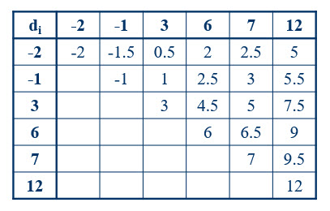

```{r, include = FALSE}
knitr::opts_chunk$set(
  collapse = TRUE,
  comment = "#>"
)
```

We can conduct a matched-pair randomization test using only the sign of the 
differences, or we can also consider the magnitude of the difference. We can 
also replace the magnitude of the difference with another score that is 
related to this magnitude such that the order or sign of the differences are 
not changed. In this vignette we will discuss two possible replacement scores 
and examine some reasons why we might want to replace our original measures of 
the magnitude of a difference.

### Required packages

The packages required for this vignette are nplearn, coin, and DescTools.

```{r setup}
library(nplearn)
library(coin)
library(DescTools)
```

### The Wilcoxon signed ranks test

A disadvantage of the Fisher-Pitman permutation test is that with even 
moderately-sized samples the number of possible permutations can grow large so 
that calculations are prohibitive. Let's look at a little table showing the 
number of differences and the number of possible permutations associated with 
that number of differences.

```{r}
differences <- 2:50
num.perms <- 2^differences
noquote(cbind(differences, format(num.perms, scientific = FALSE)))
```

Even with 50 difference scores we are into territory where calculation time 
might become a factor. I'm going to make the assumption that we can do the 
calculations for 10,000,000 permutations per second.

```{r}
2^50/10000000/60/60/24/365
```

Although 3.6 years might seem worth it for a study of high scientific value, we 
wouldn't want to do this too often. If we repeat the study with a different set 
of numbers, we have to do the calculations all over again. (Can you imagine 
being about two years into your wait for the calculations to be done when you 
suddenly discover a typo in your data set?!)

One solution to the problem is to replace our original scores with ranks. Just 
as with the Fisher-Pitman permutation test, we order the scores (now we will 
use ranks instead of scores) without regard to the observed sign. Once we have 
done this, we can then look at all possible permutations of signs. We again use the sum of the positive scores (i.e., ranks) as our test statistic. As it is 
when we use scores, and using the same hypotheses, if the null hypothesis is true, we expect the sum of positive ranks to equal the sum of negative ranks, 
but with opposite signs. If the null hypothesis is not true, we would expect 
the sum of positive ranks to become either larger or smaller than we would 
expect.

Here are the data from the fertilizer study.

```{r}
fruit <- data.frame(A = c(82, 91, 74, 90, 66, 81),
                    B = c(85, 89, 81, 96, 65, 93))

cbind(fruit$A, fruit$B)
A.minus.B <- fruit$A - fruit$B
A.minus.B
```

Here are the ranks for these data, without regard to sign.

```{r}
abs.fruit.rank <- rank(abs(A.minus.B))
abs.fruit.rank
```

Now let's attach signs to them.

```{r}
fruit.rank <- sign(A.minus.B)*abs.fruit.rank
fruit.rank
```

Our test statistic is the sum of positive ranks.

```{r}
test.statistic <- sum(fruit.rank[fruit.rank > 0])
test.statistic
```

Let's look at the distrbution of the test statistic when the null hypothesis 
is true. Notice that we are doing just what we did for the Fisher-Pitman test, 
but this time we are using ranks instead of the original scores.

```{r}
rand_dist(fruit.rank)
```

Let's clean up the table a bit by combining redundant values.

```{r}
rand_dist(fruit.rank, show.all = FALSE)
```

As we would expect, the highest probability under the null hypothesis is smack 
in the middle of the distribution: 10 and 11. We observed a value of 3. If we 
use a maximum Type I error rate of 0.10 (a confidence level of 90%), we are unable to reject this null hypothesis in favor of this alternative hypothesis.

$H_0: \theta_d = 0$

$H_a: \theta_d \ne 0$

If we had been conducting a confirmatory test that Fertilizer B included 
improvements that we expected would make it more effective, we would use these 
hypotheses.

$H_0: \theta_d = 0$

$H_a: \theta_d < 0$

In this case, with a maximum Type I error rate of 0.10, we would be able to 
reject the null hypothesis in favor of the alternative hypothesis. Note that 
the direction of the alternative hypothesis is determined by the direction of 
subtraction in order to obtain our difference scores.

So what advantage have we gained by using ranks instead of the observed differences? There are several, but we will discuss one of these right now and hold off on the others for later discussion. Recall our 3.6 year wait for 
obtaining the distribution when we have 50 paired differences? Using the Wilcoxon signed rank test, we only have to do that once. Why? Because everytime we have 50 paired differences, the ranks will be the same. So one 3.6 year wait is all that we need to compute the distribution of the test statistic that can then be used for all time. We might envision running a bunch of computers for several years, using different sample sizes, and then publishing these distributions. In fact, that's been done! You and I don't have to wait.

We have a function in R that can do the Wilcoxon test for us, so let's use it. Note that we don't have to convert to ranks first because it will do that for us.

```{r}
wilcox.test(A.minus.B)
```

The *p* value is what we obtained above. Yay!

We can also provide the observations from the separate fruit trees, but be careful. There is also a Wilcoxon test for two independent samples and that's not what we want here. We need to specify that we want a paired test. When you 
enter two sets of observations, the default is a two-sample test calculation.

```{r}
wilcox.test(fruit$A, fruit$B, paired = TRUE)
```

We can, of course, use this for a one-sided test.

```{r}
wilcox.test(fruit$A, fruit$B, paired = TRUE, alternative = "less")
```

What about if we use very large sample sizes? In that case, the function will 
switch to an approximation. (We will discuss large-sample approximations 
later.) It uses 50 as the cut-off. Up to 50, it will use an exact test. For 50 and over, it will use an approximation. We can force an exact test in these 
larger sample settings, but will it work? Let's try it.

```{r}
# Obtain 60 observations from trees with Fertilizer A. I'm going to assume that 
# these observations are normally distributed.

large.A <- rnorm(60, mean = 80, sd = 10)

# Do it again for Fertilizer B. I'm going to assume that we obtain an average 
# of 3 more bushels of fruit from this tree.

large.B <- rnorm(60, mean = 83, sd = 10)

# Let's suppose we are doing confirmatory research, so we'll do a one-sided 
# test. Now we hold our breath and hope that we aren't holding it for 400 
# years.

wilcox.test(large.A, large.B, paired = TRUE, alternative = "less", exact = TRUE)

```

Wow! It did it, and fast! Let's see how this compares to if we had just let the 
function do the large-sample approximation.

```{r}
wilcox.test(large.A, large.B, paired = TRUE, alternative = "less")
```

This is quite good, which is why the function switches to the large-sample 
approximation at 50. We know that the Fisher-Pitman permutation test with
original scores would take way too long for us to do in our lifetime. (Maybe 
grandchildren could get our results off the printer and help establish our 
lebacy!) Yet we also know that the *t* test is a large-sample approxiamation 
for the Fisher-Pitman permutation test, so let's see how those results compare. 

```{r}
t.test(large.A, large.B, paired = TRUE, alternative = "less")
```

Remember that we simulated this study using random numbers, so your results 
will be different than mine, and my results will be different every time I go 
through this vignette. What we do know is that *most of the time* we should 
obtain a smaller *p* value with the *t* test. Why? Because we have exactly met the conditions for valid inference with the *t* test by simulating our data 
using a normal distribution. I will venture, however, that most of the time 
when you try this with normally distributed data that your results will not differ too drastically from what you are obtaining with the Wilcoxon test. This 
is surprising given that the *t* test is valid, and most powerful, when the sample comes from a normal distribution. We will discuss this further when we compare the power of competing methods.

### Conditions for valid inference

When we used original scores, rather than ranks, the permutation test was the 
Fisher-Pitman permutation test. Here are the conditions for valid inference we 
needed with the Fisher-Pitman test.

1. The sample is randomly drawn from the population of interest.
2. Pairs must be independent of one another.
3. The scale of measurement is interval.
4. The differences obtained within pairs are symmetrically distributed across pairs. This last condition can be achieved with randomization of pair members to the treatment and control conditions.

The conditions for valid inference with the Wilcoxon signed ranks test are the same as those for the Fisher-Pitman permutation test. This leads to an 
obvious question: Which should we use? Above we saw that we can use the Wilcoxon method for sample sizes that are too large for the Fisher-Pitman permutation method, at least in our lifetimes. Later we will answer the question for 
situations in which both methods are possible.

### The "problem" of ties

I am going back to our original fertilizer example, but I'm going to alter the 
scores a bit so that you can see how it creates a "problem."

```{r}
fruit$A2 <- c(82, 91, 74, 90, 66, 81)
fruit$B2 <- c(85, 89, 80, 96, 65, 93)
A2.minus.B2 <- fruit$A2 - fruit$B2
cbind(fruit$A2, fruit$B2, A2.minus.B2)
```

Only one value changed slightly, yet this one change means that we have a tie 
among our difference scores. Why is this important? If we are going to rank 
the absolute value of the differences, as is required for the Wilcoxon method, 
how do we rank the two values of -6? (Note that we would have also had a tie 
if one of these was -6 and one was 6, because we rank the absolute values of 
the scores.)

At least three methods have been proposed for dealing with ties. These are:

*Eliminate the tied values
*Randomly assign the two ranks to the tied values
*Use midranks

The first of these options runs counter to a major pillar of science: Gather as much information as you can to better understand variable relationships. Throwing out data is rather distasteful. From a statistical point of view, we are not going to be happy about taking an already small sample of six pairs and throwing out one-third of the data to leave us with four pairs.

Although the second method retains the data, it also means that two researchers with the exact same scores can arrive at two different results because they some of their results are due to chance outcomes. Although randomness is a powerful tool for both sampling and experimentation, we do not want to randomly select our findings, yet that is  what we are doing if we randomly assign ranks and then use a statistical method based on ranking.

The third option addresses all of the concerns of the first two methods. All the data are retained and rankings are not left to chance. A midrank is simply the average of the ranks that would have been assigned to the scores if they were slightly different from each other. For example, look at the ranks that we assigned with our original fruit data.

```{r}
cbind(A.minus.B, abs.fruit.rank)
```

The values of -6 and -7 received the ranks of 4 and 5, respectively. Now that 
the value of -7 has changed to -6, we still want to use the ranks of 4 and 5 because those are the correct ranks in the context of the other scores. Yet rather than throwing out or randomly assigning these ranks, we average them and 
assign this average to both values. The ranking function in R accomplishes this task for us.

```{r}
fruit2.rank <- rank(abs(A2.minus.B2))
fruit2.rank
```

We can look at the distribution of sums of all possible positive ranks, just as we did when we did not have ties.

```{r}
rand_dist(fruit2.rank, show.all = FALSE)
```

Here is the sum of positive ranks with our new fruit data.

```{r}
sum((A2.minus.B2 > 0)*A2.minus.B2)
```

Looking at 3 in the distribution, we can calculate our *p* value.

```{r}
.078125 * 2
```

The use of midranks makes so much sense and is the recommended method by many prominent nonparametric statisticians. So why are the other two methods even considered? Let's see what happens when we use the Wilcoxon test function with these data.

```{r}
wilcox.test(A2.minus.B2, exact = TRUE, conf.level = 0.90)
```

The function doesn't work! It provides a *p* value, but this is a large-sample approximation, and obviously we don't have a large sample. (Though, admittedly, that *p* value is not very far off.) The algorithm for the exact test that is programmed into many major statistical software packages assumes that there are no ties. Indeed, you can find textbooks that add a condition of either no ties or continuous data (so that you can't have ties) as a condition for valid inference. Yet we have just seen with our distribution that this condition is not necessary. Fortunately, we are using R and can access many additional functions that are not programmed into base R. Let's see what the coin package 
does if we provide it these tied values. The coin package has a function for the Wilcoxon signed ranks test.

```{r}
wilcoxsign_test(fruit$A2 ~ fruit$B2, distribution = "exact")
```

That's the same *p* value we obtained. Yes! Notice this is now called the Wilcoxon-Pratt test. That's because Wilcoxon assumed no ties, but back in 1959, Pratt realized that you could use a distribution that includes midranks, just like we did, so that is implemented into the coin algorithm.

Let's see if this can handle a larger problem, such as the one we looked at above. This time I'm going to round the numbers so that we have a good chance of getting tied ranks.

```{r}
# Obtain 60 observations from trees with Fertilizer A. I'm going to assume that 
# these observations are normally distributed.

large.A <- round(rnorm(60, mean = 80, sd = 10))

# Do it again for Fertilizer B. I'm going to assume that we obtain an average 
# of 3 more bushels of fruit from this tree.

large.B <- round(rnorm(60, mean = 83, sd = 10))

# Let's see if we have any ties.

rank(abs(large.B - large.A))
```

Now let's see if the function works for us. Remember we did a one-sided test for this example.

```{r}
wilcoxsign_test(large.B ~ large.A,
                distribution = "exact",
                alternative = "greater")
```

Let's see how this *p* value compares to that of the *t* test.

```{r}
t.test(large.B - large.A, alternative = "greater")
```

Pretty close!

### A confidence interval for the median

We have already seen how to construct a confidence interval for the median using the sign test. If we have symmetry, as we do when we use matched pairs and randomize to conditions, we can obtain a narrower interval by constructing a confidence interval using the Wilcoxon test.

#### Walsh averages

The first step in confidence interval construction is to construct Walsh averages. A Walsh average is the average of a pair of scores. We will need to construct all Walsh averages for all pairs of difference scores. Let's use our 
small fertilizer data set as an example. Here is a matrix of Walsh averages.



#### The Hodges-Lehmann median estimate

Hodges and Lehmann showed that the median of Walsh averages is an estimate of the median of scores with strong statistical properties. Thus, in this example, here is the estimate of the median.

```{r}
median(c(-2, -1.5, -1, 0.5, 1, 3, 2, 2.5, 4.5, 6, 2.5, 3, 5, 6.5, 7,
         5, 5.5, 7.5, 9, 9.5, 12))
```

This is a point estimate, which is useful information, but we seek an interval estimate that has an associated level of confidence. Look again at the distribution of the possible sum of positive ranks.

```{r}
rand_dist(c(1, 2, 3, 4, 5, 6), show.all = FALSE)
```

There's something interesting to note. The maximum possible sum of ranks is 21, which also happens to be the number of Walsh averages. Coincidence? No! This is always the case, and this knowledge leads to a simple method of confidence interval construction. Note in our distribution that we will reject (at the 90% confidence level) for values less than, or equal to, 2. We can translate this onto our chart of Walsh averages by rejecting the 2 lowest values and the 2 highest values in our table, then putting all other values in the confidence interval. This provides the following interval.

$-1 \le \theta \le 9$

Here is the calculation using the wilcox.test function.

```{r}
wilcox.test(A.minus.B,
            alternative = "two.sided",
            conf.int = TRUE,
            conf.level = 0.90)
```

The subtraction was in the opposite direction of ours, but this is no matter as long as we interpret based on direction. Let's compare it to the interval using the sign test.

```{r}
SignTest(A.minus.B, conf.level = 0.90)
```

This is wider than the interval we obtained with the Wilcoxon method, which is to be expected when the data are symmetrical. If the data were normal, we could obtain an even narrower interval with the *t* test, but we shouldn't go there unless we know we have normally distributed data.

