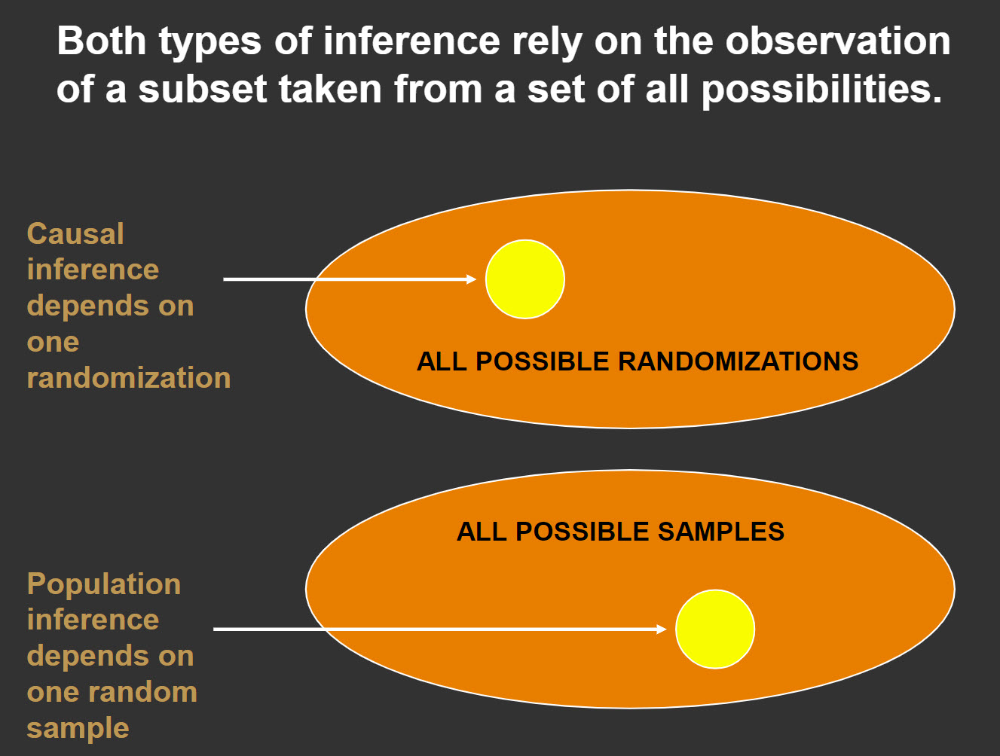

```{r, include = FALSE}
knitr::opts_chunk$set(
  collapse = TRUE,
  comment = "#>"
)
```

Randomization tests form the backbone of many nonparametric methods. With 
traditional statistics instruction, the emphasis is often on estimating a 
parameter by sampling from an unknown population. We use randomization tests 
to estimate parameters that will inform us about causal relationships among 
the explantory and response variables.

### Required packages

The packages required for this vignette are nplearn and coin.

```{r setup, echo = TRUE, message = FALSE}
library(nplearn)
library(coin)
```

### The sign test as a randomization test

In the sign test vignette, I introduced the sign test as a special case of the 
binomial test. This is an important special case because in a true experiment, 
when members of a matched pair are randomly assigned to conditions, the null 
hypothesis of no treatment effect will result in an expectation that in 50% of 
the pairs we will observe an outcome that favors the control condition and in 
50% of the pairs we will observe an outcome that favors the treatment condition.
The expectation is a consequence of chance assignment. By contrast, if the 
treatment has some positive effect, then we would expect a higher number of 
positive treatment outcomes in the set of matched pairs.

Let us consider again the fertilizer study that we used when learning about the sign test. In that study, we observed 12 trees matched into 6 pairs with each 
pair of trees on a different plot of land from the other pairs. Fertilizers A 
and B were randomly assigned to trees within a pair. (We say that the trees 
were *randomized* to the fertilizer conditions.) Suppose that there is no 
difference in the effectiveness of fertilizers. Would we expect each fruit tree 
in a matched pair to yield the same amount of fruit? On average across all 
fruit trees we would expect similar fruit yield, but for any given pair of 
trees we could well observe different yields due to a variety of extraneous 
variables, such as tree size, sun exposure, water absorption, and so forth. So 
if fertilizer is not responsible for a difference, and if fertilizers are 
randomly assigned to the members of each matched pair, what is responsible for 
a fertilizer being associated with the tree that yields the most fruit? The 
answer, of course, is random assignment. So, for example, if Fertilizer B 
"outperforms" Fertilizer A within a particular pair, it really is not a matter 
of better performance, but rather due to chance assignment. One tree produced 
more fruit than the other, and Fertilizer B came along for the ride. Similarly 
for all fruit tree pairs.

Here again are the observed data, both in terms of fruit production and in 
differences among matched pairs.

```{r}
fruit <- data.frame(A = c(82, 91, 74, 90, 66, 81),
                    B = c(85, 89, 81, 96, 65, 93))

cbind(fruit$A, fruit$B)
A.minus.B <- fruit$A - fruit$B
A.minus.B
```

With no difference in fertilizer effectiveness, whether a fertilizer was 
assigned to the tree bound to be the highest or lowest producer in a pair is 
a matter of chance. Thus, when looking at the differences, the sign is due to 
chance assignment. If the "coin flip" had assigned the fertilizers in the 
opposite manner, the quantities would remain the same, but the sign of each 
difference would be reversed. All the plus signs would become minus signs, and 
vice versa.

Now let us consider all the possible ways this chance assignment could have 
taken place. This is illustrated in Figure 1.


Each row represents one possible arrangement of signs. There are 64 possible 
arrangements. *T* is the number of plus signs, which is what we used as our 
test statistic for the sign test. If there is no difference in the 
effectiveness of the fertilizers, then the sign for each tree-pair difference 
is due to chance. Further, each of the patterns of plus and minus signs are equally likely. The chance of observing a particular one of the 64 patterns is calculated below.

```{r}
1/64
```

Here is another way to calculate it.

```{r}
1/2^6
```

Note, however, that some patterns contain the same number of plus signs as 
other patterns. For example, there are six different ways to obtain five plus 
signs. Thus, given that each pattern is equally likely, the probability of 
obtaining five plus signs can be calculated like this.

```{r}
6*(1/2^6)
```

This is the same probability that we obtained for the sign test when using the 
binomial distribution with parameters 6 and 0.5.

```{r}
dbinom(5, 6, 0.5)
```

It should come as no surprise that the binomial distribution can be used to 
calculate the probability for any number of plus signs. The difference here is 
that we are focusing on all possible patterns, with each pattern equally 
likely. To make this explicit, here's a little table in which we list the 
number of plus signs, the number of patterns resulting in that number of plus 
signs, and the probability of obtaining that number of plus signs calculated 
two ways: multiplying the number of patterns by the probability of one pattern 
and using the binomial distribution.

```{r}
T <- 0:6
num.patterns <- choose(6, T)
prob.1 <- num.patterns*(1/2^6)
prob.2 <- dbinom(T, 6, 0.5)
cbind(T, num.patterns, prob.1, prob.2)
```

Notice that the number of patterns sums to what we would expect.

```{r}
sum(num.patterns)
```

### The Fisher-Pitman permutation test

We already know how to conduct a sign test for the fertilizer data, 
so why review it again with an emphasis on these 64 patterns? I'm glad you 
asked! By making the patterns of signs explicit, we can now associate each of 
these signs with some indicator of the magnitude of the difference in 
production for each fruit tree pair. For the sign test, we ignored this 
magnitude, simply considering a difference as favoring one fertilizer or the 
other. Now let's look at the same 64 patterns, but this time associate each 
sign with the quantity of that difference. The picture is Figure 2.


The first row contains the magnitude of differences, in order, without a sign 
attached. Let's think about that a moment, focusing on the score of "6". In our 
data set, it was actually "-6". Given that we subtracted the yield of the tree 
receiving Fertilizer B from the yield of the tree receiving Fertilizer A, our 
"-6" means that the tree receiving Fertilizer B gave us 6 more units (e.g., 
pieces of fruit or bushels of fruit or bushels per day of fruit) than we 
obtained from the tree receiving Fertilizer A. Yet if there is no difference 
in the effectiveness of fertilizers, this observed difference is due to other 
factors. So what if, when we had randomized trees to fertilizer conditions, 
these trees had been swapped? That is, what if the tree now receiving 
Fertilizer B was, instead, given Fertilizer A? Would we still expect a 
difference of 6 units? If the fertilizers are not causing the difference, yes 
we would! If we had swapped, we would still observe a 6, but this time it would 
be a positive 6. In short, if the fertilizers are no different in their ability 
to increase fruit yield, the magnitude of the differences will stay the same 
regardless of how we randomize. The only effect of randomization is to 
determine the sign associated with that magnitude.

The 64 patterns of plus and minus signs represent all the possibilities for 
which of the quantities receive a "+" and which receive a "-". For the sign test, we defined the test statistic, *T*, to be the number of plus signs. Similarly, when we want to take into account the quantity of the differences, 
we can define *T* to be the sum of the positive values. This is shown in the last column of Figure 2. When we have randomized trees to fertilizer conditions and when this is the only reason for the sign (i.e., the fertilizers are 
equally effective), each of the 64 patterns are equally likely. This means that the probability of many of these values is the reciprocal of the number of patterns, in this case 1/64. Sometimes, however, multiple patterns can result 
in the same sum of positive scores. In Figure 2, we notice that there are two 
values of 28. Thus, the probability of obtaining 28 is 2*(1/64).

I would like to look at the entire distribution of T. Here's a function that 
I wrote to help me achieve this goal.

```{r}
rand_dist(A.minus.B)
```

This table provides the test statistic, the probability of obtaining that 
value of the test statistic, and the cumulative probability, both from the 
bottom and the top, of obtaining less than (or more than) that value of the 
test statistic. Keep in mind that these probabilities are only valid if the 
fertilizers do not differ in effectiveness, but that's OK, because that is our 
null hypothesis. If the null hypothesis is true, the population median is 0. 
Again, we know this because half of the differences will be negative and half 
will be positive. So let's test the null hypothesis against an alterative 
hypothesis.

$H_0: \theta = 0$

$H_0: \theta \ne 0$

If most of the difference scores are negative, we expect a small value for 
*T*, the sum of the positive difference scores. If most of them are positive, 
we expect a larger value for *T*. Thus, the values of *T* on either end of the 
above distribution will provide evidence that the null hypothesis is false. 
We have a small sample size (*n* = 6), so let's set our maximum Type I error 
rate at 0.10, or 10%. Taking the most extreme values at either end of the 
distribution, the probability of observing 0, or 1, or 2, or 29, or 30, or 31 can be calculated by summing either the individual probabilities, or the cumulative up and down.

```{r}
.015625 + .015625 + .015625 + .015625 + .015625 + .015625
0.046875 + .046875
```

What if we add one more value on either end (3 and 28)? Notice that we have 
two ways to obtain 3 and two ways to obtain 28. We can't pick and choose. We 
need to enter all values of 3 and all values of 28. Here is the probability 
that *T* is 3 or less or 28 or more.

```{r}
0.078125 + 0.078125
```

Putting 3 or 28 in our rejection region would take us over our tolerance for 
Type I errors, so we will use 2 and 27 as our critical values. This means that 
$\hat{\alpha} = .09375$. Here again are our difference scores.

```{r}
A.minus.B
```

The observed value of the test statistic is the sum of the positive 
differences.

```{r}
sum((A.minus.B > 0)*A.minus.B)
```

This is not in the rejection region, so we fail to reject the null hypothesis. 
It would have been simpler to go straight to the *p* value, so let's do that 
now. Remember that this is a two-sided test and the distribution of the test 
statistic is symmetrical so that we can multiply a one-sided *p* value by 2.

```{r}
.078125 * 2
```

Our lives were complicated a bit by seeing duplicate values of the test 
statistic. These are due to various combinations of signs that can result in 
the same sum of positive numbers. We can simplify life by removing the 
duplicates, so I incorporated that possibility in the function.

```{r}
rand_dist(A.minus.B, show.all = FALSE)
```

You will now notice varying probabilities for each specific value. These are 
due to the varying number of permutations that result in this value of the 
test statistic.

The size of the distribution of *T* can grow quickly, so with larger sample 
sizes we need to curb our enthusiasm. For example, in the sign test vingette we 
looked at differences for 60 pairs of fruit trees. Let's see how many possible 
joint events we have when considering the sign of the difference.

```{r}
2^60
```

If you are planning to create this distribution, you will be waiting awhile! 
Assuming that R is fast enough to generate 10,000,000 of the possible 
permutations each second (which would be quite impressive!), this is how long 
we would have to wait, in years.

```{r}
2^60/10000000/60/60/24/365
```

Make sure you have an ample supply of food and water before locking yourself in a room to calculate this distribution. Most of us are unwilling to wait that 
long, even if it means that we can calculate exact results. We have several 
options available to us. Some of these I will discuss in future vignettes. One 
option will be discussed below: using a large-sample approximation.

Again you are probably wondering if there are R functions that give us what we 
need in order to make inferences without computing and examining the entire 
distribution of the test statistic. Again, the answer is "yes." This is not in 
the Base R system, but can be found in the *coin* package. (The term "coin" is 
used as an acronym for *conditional inference procedures in a permutation 
test framework*.) The package is powerful and extends well beyond what we have 
been learning using a general framework. As such, the way you will need to use 
functions seem a bit over-the-top for this seemingly simple task, yet that is 
only because a single function can do so much. We will see this in later 
discussions. For now, and without explanation, I'll show you how to get what 
we need using the fertilizer data.

```{r}

# Our observations are in two variables that have been matched.

fruit$A
fruit$B

dta <- data.frame(
  y = c(fruit$A, fruit$B),
  x = gl(2, length(fruit$A)),
  block = factor(rep(seq_along(fruit$A), 2))
)

symmetry_test(y ~ x | block, data = dta,
              distribution = "exact")
```

This function calculates a Z statistic based on our data, but then creates an 
exact distribution of this statistic, so the *p* value we obtained is the 
same as what we obtained earlier. Here's what we would have done if we were 
confirming that Fertilizer B was more effective, based on theory-based 
development of the fertilizer. The function is going to subtract Fertilizer B 
outcomes from Fertilizer A outcomes, just like we did, so we need to test in 
the lower tail.

```{r}
symmetry_test(y ~ x | block, data = dta,
              distribution = "exact", alternative = "less")
```

If you have already created the difference scores, the code used is a bit 
different, but the results are the same.

```{r}
y <- as.vector(rbind(abs(A.minus.B) * (A.minus.B >=0),
                     abs(A.minus.B) * (A.minus.B < 0)))

x <- factor(rep(0:1, length(A.minus.B)), labels = c("pos", "neg"))
block <- gl(length(A.minus.B), 2)

symmetry_test(y ~ x | block,
              distribution = "exact", alternative = "less", paired = TRUE)
```

You can check these results with our complete distribution above. Let's try 
one more trick. Here are the data from the larger example we used in the sign 
test vignette.

```{r}
B.minus.A <- c(-1, 0, -1, 0, 4, 5, 25, 15, 5, 125, 61, 2, 7, -2, 2, 1, 7, 12,
               23, 1, 86, 17, 6, 12, -1, 1, -1, -2, 58, 3, 2, 18, 1, 40, -1,
               2, 12, 0, 3, 6, -2, 1, 56, 5, -2, 8, -2, -1, 30, 1, 2, 52,
               3, -1, 52, 7, 18, 9, 145, 17)
```

We saw that an exact test would take many years, even with a fast computer, so 
what does the symmetry_test function do with these data? First, let's set it 
up. Note that I subtracted A from B in this example, so you need to switch around to an upper-sided test.

```{r}
y <- as.vector(rbind(abs(B.minus.A) * (B.minus.A >=0),
                     abs(B.minus.A) * (B.minus.A < 0)))

x <- factor(rep(0:1, length(B.minus.A)), labels = c("pos", "neg"))
block <- gl(length(B.minus.A), 2)

```

Now try running this function.

> symmetry_test(y ~ x | block, 
                distribution = "exact", alternative = "greater", paired = TRUE)

No surprise. It tells us to take a hike. Let's tweak this just a bit by taking 
out the request for an exact test.

```{r}
symmetry_test(y ~ x | block,
              distribution = "approximate",
              alternative = "greater",
              paired = TRUE)
```

Oh, that's nice! But what is it? You'll have to wait for me to provide the 
details in another vignette. You should already have figured out that this 
is providing an approximate *p* value. Approximations in the world of 
nonparametric statistics are of a different type than those in traditional 
parametric statistics, so we'll need to spend a bit of time on this; but not 
now.

### The need for symmetry

We know that when the null hypothesis is true that we will expect half of our 
differences to have positive signs and half to have negative signs. We also 
know that the result of this is that the population median is 0, so that is the 
null hypothesis we want to test. What do we expect for *T*, our sum of positive 
values, if the median is 0? It turns out that without additional conditions, we don't know what to expect for *T*. The median might be 0 for a skewed distribution. If there is positive skew, we expect *T* to be larger than if there is negative skew, even though in both cases our null hypothesis, that the median is 0, is true. Thus, if we allow for a skewed distribution, *T* is not going to be a valid test statistic.

What do we do? We must assume symmetry (i.e. no skew). With this additional condition, we expect the mean of *T* to also be the median of *T*. This 
provides a valid test of the null hypothesis and also tells us which values to put in our rejection region: Those that are furthest from the median (or mean) of *T*. As always, we will put these in the direction that favors the alternative hypothesis and will work back toward the median of the distribution until we have put in as many values as we can without exceeding our tolerance for error.

If you are thinking that we have now wandered into the realm of strong conditions for valid inference, you are partly correct, but only partly. The requirement that the distribution be symmetrical is indeed a strong condition, though not as strong as necessitating that it be normally distributed. Yet 
there is no reason for pessimism. When we randomize members of matched pairs to conditions and the null hypothesis is true, the difference scores for these 
pairs will be symmetrical, even if the original scores are not. This is because 
we expect similar numbers of positive and negative signs attached to the 
quantities that represent those differences. These quantities should be the 
same in the negative direction as they are in the positive direction. This 
means that the symmetry requirement is addressed through randomization. In 
practical terms, we can choose to view randomization, rather than symmetry, as 
a condition for valid inference.

### A large-sample approximation for *T*

We have been exploring the use of *T* as a test statistic when it is defined 
as the sum of the positive scores. We can prove that the mean is linearly
connected to the sum of positive scores. As such, we could have used the mean 
of scores for *T* and obtained the same results with the Fisher-Pitman 
permutation test. So why not use the mean? After all, when we were in our 
statistical infancy, the mean dominated our conversation. There is a good 
reason. By using the sum of positive scores we are using the same 
techniques as those we used in the sign test. Further, we will continue using this framework for additional methods. Thus, we are keeping our methods in a general framework that should make it easier for understanding and remembering.

Yet the fact that the mean *could have* been used as our test statistic opens 
up an obvious approximate test when we have large samples. We know, by the 
Central Limit Theorem, that for many distributions and with large samples that the sampling distribution of the mean is approximately normal. with this in 
mind, we can propose the use of normal-distribution methods when we have large 
samples. For the mean, we could have tested the hypothesis that the median 
of differences is 0 using a single-sample *t* test. (We began by testing the 
median, so I'm sticking with it. Recall that with the null hypothesis of 
no treatment effect and with randomization, the differences are symmetrical, so the median and the mean are the same.)

One of the beauties of the nonparametric framework is the merging of methods 
that are considered nonparametric and parametric. We will see this with 
multiple methods, culminating in generalized linear models. For now, it is 
gratifying to note that when we are studying potential treatment effects with a 
matched-pair design and are true to the conditions for valid inference (random sampling, independence of pairs, and randomization), a nonparametric method 
(the Fisher-Pitman permutation test) will provide exact Type I error rates 
for every sample size, when the parametric method (the *t* test) may not. Yet 
when sample sizes get so large as to render the permutation test results inaccessible in a reasonable period of time, the *t* test can be called in as a surrogate and will yield Type I error rates that are very close to actual error rates.

Here's the large-sample approximation for the B minus A differences that we 
considered above.

```{r}
t.test(B.minus.A)
```

As noted earlier, we have a different type of large-sample approximation for 
the Fisher-Pitman permutation test that is based on approximating what the *p* 
value would be if we had actually been able to perform all permutations without 
waiting for the end of the world. When we used that with these data, we were 
given this.

$p = .0001$

When we used the *t* test, we were given this.

$p = .00009$

Pretty close, and differences could mostly be due to rounding. Note that the 
*t* method also provides us a confidence interval for the mean. Before 
you get too excited about that, remember that symmetry of difference scores is 
based on (1) randomizing with the matched pair design and (2) the null 
hypothesis of no difference is true. As you know, to construct a confidence 
interval we need to test every null hypothesis, not just the hypothesis of no 
difference (i.e., that the median of differences is 0).

So can we believe the confidence interval given to us by the *t* test function? 
Yes, with a large enough sample size this is a confidence interval for the 
mean. Keep in mind, that the reason this works is because the sampling distribution of the mean is approximately normal for large sample sizes. Large 
sample sizes **do not** change the original distribution of difference scores. 
The original distribution may be skewed. The sampling distribution will be 
symmetrical and normal. Thus, you can believe that the interval includes the 
mean with the stated level of confidence. Yet if the distribution is not symmetrical, the mean is not the parameter we should be interested in. For skewed distributions, the median is a more appropriate indicator of center. 
Without symmetry, the mean and median are not the same, so the value of this 
confidence interval is limited.

### A single-sample without randomization

If we want to use the Fisher-Pitman permutation method for either an observational study (i.e., there has not been randomization) or to examine the properties of a single sample of scores, rather than matched-pairs differences, we are required to add symmetry as a condition for valid inference. This seriously limits the practical usefulness of the methods in non-experimental settings. In this case, we have two reasonable choices. (I don't consider an assumption of symmetry to be a reasonable choice.) One is to ignore the quantities by switching to the sign test. Recall that the conditions for valid inference with the sign test are very easy to jusitify in most research settings. The second choice is to obtain a large sample and use a large-sample approximation. We will discuss the large-sample approximation method for permutation tests in another vignette.

### Randomization versus permutation

I have waited until the end to discuss the title to this vignette. 
A randomization test is a hypothesis testing technique based on considering all possible ways that the units can be assigned to treatment and control 
conditions. These are permutations, so sometimes *randomization test* and *permutation test* are used as synonyms, but I think this can cause confusion. 
A randomization test involves two components: a design component 
(randomization) and a statistcal testing component, based on permutations. By 
contrast, a permutation test can be conducted regardless of whether or not 
units were randomized to conditions. You might calculate statistics, such as 
*p* values, in the same way as with a randomization test, yet there is an 
important distinction between what you can conclude in these two situations. 
For example, in the matched-pair setting, without randomization you cannot expect that the distribution of difference scores will be symmetrical. Yet symmetry is a requirement for the correct calculation of *p* values. From a design perspective, without randomization you cannot conclude that unusual outcomes (such as a low *p* value) are due to treatment effectiveness.

The Fisher-Pitman permutation test is so-named because we look at all possible permutations of the signs of the differences. If under the null hypothesis 
these signs are due to random assignment to conditions, we could just as well 
call this the Fisher-Pitman randomization test. Indeed, provides the strongest use of the test. Permuting signs of potential differences takes us to the realm of strong conditions, such as that of symmetry.

In most introductory statistics books that I have encountered, reference is 
made to random sampling from a population in order to make observations, calculate statistics, and infer back to a parameter. For example, we might select a random sample of American teenagers and record a body mass index as a way of understanding the body mass index for the larger population. Specifically, we might calculate the mean for our sample and use that to make inferences about the population mean. We might refer to this as *population inference*. Randomization tests offer another perspective on inference. We calculate probabilities based on all possible randomizations, yet we only "sample" one of these. From this sample we then decide if we can infer that there is a treatment effect. We might call this *causal inference*.



As researchers, one of our greatest wishes would be to randomly sample and then randomize to conditions, thus giving us a means to make both an inference about cause-effect and an inference about the size of this effect in a larger population. Unfortunately, few studies do both. The good news is that if we can randomize, we can make causal inferences regardless of the nature of our 
sample. We certainly cannot make these inferences pertain to broader 
populations than those represented by the units in our sample, yet 
understanding cause-effect relationships is a primary goal of science. The ability to infer such a relationship is a large step toward addressing our research goals.
