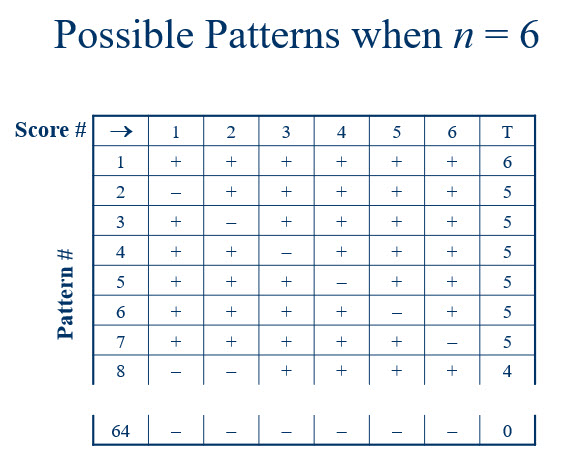
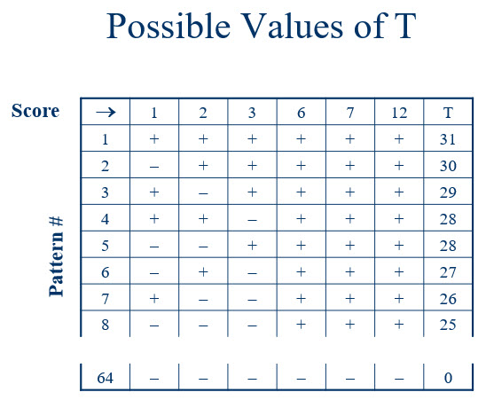

```{r, include = FALSE}
knitr::opts_chunk$set(
  collapse = TRUE,
  comment = "#>"
)
```

Randomization tests form the backbone of many nonparametric methods. With 
traditional statistics instruction, the emphasis is often on estimating a 
parameter by sampling from an unknown population. We use randomization tests 
to estimate parameters that will inform us about causal relationships among 
the explantory and response variables.

### Required packages

The packages required for this vignette are the nplearn package and the gtools 
package..

```{r setup}
library(nplearn)
library(gtools)
```

### The sign test as a randomization test

In the sign test vignette, I introduced the sign test as a special case of the 
binomial test. This is an important special case because in a true experiment, 
when members of a matched pair are randomly assigned to conditions, the null 
hypothesis of no treatment effect will result in an expectation that in 50% of 
the pairs we will observe an outcome that favors the control condition and in 
50% of the pairs we will observe an outcome that favors the treatment condition.
The expectation is a consequence of chance assignment. By contrast, if the 
treatment has some positive effect, then we would expect a higher number of 
positive treatment outcomes in the set of matched pairs.

Let us consider again the fertilizer study that we used when learning about the sign test. In that study, we observed 12 trees matched into 6 pairs with each 
pair of trees on a different plot of land from the other pairs. Fertilizers A 
and B were randomly assigned to trees within a pair. (We say that the trees 
were *randomized* to the fertilizer conditions.) Suppose that there is no 
difference in the effectiveness of fertilizers. Would we expect each fruit tree 
in a matched pair to yield the same amount of fruit? On average across all 
fruit trees we would expect similar fruit yield, but for any given pair of 
trees we could well observe different yields due to a variety of extraneous 
variables, such as tree size, sun exposure, water absorption, and so forth. So 
if fertilizer is not responsible for a difference, and if fertilizers are 
randomly assigned to the members of each matched pair, what is responsible for 
a fertilizer being associated with the tree that yields the most fruit? The 
answer, of course, is random assignment. So, for example, if Fertilizer B 
"outperforms" Fertilizer A within a particular pair, it really is not a matter 
of better performance, but rather due to chance assignment. One tree produced 
more fruit than the other, and Fertilizer B came along for the ride. Similarly 
for all fruit tree pairs.

Here again are the observed data, both in terms of fruit production and in 
differences among matched pairs.

```{r}
fruit <- data.frame(A = c(82, 91, 74, 90, 66, 81),
                    B = c(85, 89, 81, 96, 65, 93))

cbind(fruit$A, fruit$B)
A.minus.B <- fruit$A - fruit$B
A.minus.B
```

With no difference in fertilizer effectiveness, whether a fertilizer was 
assigned to the tree bound to be the highest or lowest producer in a pair is 
a matter of chance. Thus, when looking at the differences, the sign is due to 
chance assignment. If the "coin flip" had assigned the fertilizers in the 
opposite manner, the quantities would remain the same, but the sign of each 
difference would be reversed. All the plus signs would become minus signs, and 
vice versa.

Now let us consider all the possible ways this chance assignment could have 
taken place. This is illustrated in Figure 1.



Each row represents one possible arrangement of signs. There are 64 possible 
arrangements. *T* is the number of plus signs, which is what we used as our 
test statistic for the sign test. If there is no difference in the 
effectiveness of the fertilizers, then the sign for each tree-pair difference 
is due to chance. Further, each of the patterns of plus and minus signs are equally likely. The chance of observing a particular one of the 64 patterns is calculated below.

```{r}
1/64
```

Here is another way to calculate it.

```{r}
1/2^6
```

Note, however, that some patterns contain the same number of plus signs as 
other patterns. For example, there are six different ways to obtain five plus 
signs. Thus, given that each pattern is equally likely, the probability of 
obtaining five plus signs can be calculated like this.

```{r}
6*(1/2^6)
```

This is the same probability that we obtained for the sign test when using the 
binomial distribution with parameters 6 and 0.5.

```{r}
dbinom(5, 6, 0.5)
```

It should come as no surprise that the binomial distribution can be used to 
calculate the probability for any number of plus signs. The difference here is 
that we are focusing on all possible patterns, with each pattern equally 
likely. To make this explicit, here's a little table in which we list the 
number of plus signs, the number of patterns resulting in that number of plus 
signs, and the probability of obtaining that number of plus signs calculated 
two ways: multiplying the number of patterns by the probability of one pattern 
and using the binomial distribution.

```{r}
T <- 0:6
num.patterns <- choose(6, T)
prob.1 <- num.patterns*(1/2^6)
prob.2 <- dbinom(T, 6, 0.5)
cbind(T, num.patterns, prob.1, prob.2)
```

Notice that the number of patterns sums to what we would expect.

```{r}
sum(num.patterns)
```

So what? We already know how to conduct a sign test for the fertilizer data, 
so why review it again with an emphasis on these 64 patterns? I'm glad you 
asked! By making the patterns of signs explicit, we can now associate each of 
these signs with some indicator of the magnitude of the difference in 
production for each fruit tree pair. For the sign test, we ignored this 
magnitude, simply considering a difference as favoring one fertilizer or the 
other. Now let's look at the same 64 patterns, but this time associate each 
sign with the quantity of that difference. The picture is Figure 2.



The first row contains the magnitude of differences, in order, without a sign 
attached. Let's think about that a moment, focusing on the score of "6". In our 
data set, it was actually "-6". Given that we subtracted the yield of the tree 
receiving Fertilizer B from the yield of the tree receiving Fertilizer A, our 
"-6" means that the tree receiving Fertilizer B gave us 6 more units (e.g., 
pieces of fruit or bushels of fruit or bushels per day of fruit) than we 
obtained from the tree receiving Fertilizer A. Yet if there is no difference 
in the effectiveness of fertilizers, this observed difference is due to other 
factors. So what if, when we had randomized trees to fertilizer conditions, 
these trees had been swapped? That is, what if the tree now receiving 
Fertilizer B was, instead, given Fertilizer A? Would we still expect a 
difference of 6 units? If the fertilizers are not causing the difference, yes 
we would! If we had swapped, we would still observe a 6, but this time it would 
be a positive 6. In short, if the fertilizers are no different in their ability 
to increase fruit yield, the magnitude of the differences will stay the same 
regardless of how we randomize. The only effect of randomization is to 
determine the sign associated with that magnitude.

The 64 patterns of plus and minus signs represent all the possibilities for 
which of the quantities receive a "+" and which receive a "-". For the sign test, we defined the test statistic, *T*, to be the number of plus signs. Similarly, when we want to take into account the quantity of the differences, 
we can define *T* to be the sum of the positive values. This is shown in the last column of Figure 2. When we have randomized trees to fertilizer conditions and when this is the only reason for the sign (i.e., the fertilizers are 
equally effective), each of the 64 patterns are equally likely. This means that the probability of many of these values is the reciprocal of the number of patterns, in this case 1/64. Sometimes, however, multiple patterns can result 
in the same sum of positive scores. In Figure 2, we notice that there are two 
values of 28. Thus, the probability of obtaining 28 is 2*(1/64).

I would like to look at the entire distribution of T. Here's a function that 
I wrote to help me achieve this goal.

```{r}
rand_dist(A.minus.B)
```

