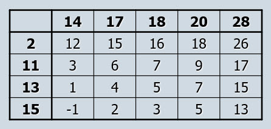

```{r, include = FALSE}
knitr::opts_chunk$set(
  collapse = TRUE,
  comment = "#>"
)
```

Two-sample procedures are the basis for much research in the social and 
behavioral sciences. Indeed, the classic experimental setup is to establish 
control and treatment conditions, then randomize study participants to those 
conditions. The control condition is often a placebo or "traditional" 
intervention,  and the experimental condition is a new intervention that was 
developed to achieve improvement, as measured by the outcome or response 
variable. This experimental arrangement will often lead to directional research 
hypotheses (e.g., those in the experimental condition will outperform those 
in the control condition), though two sample procedures can be used for 
non-directional hypotheses as well. They can also be used for observational 
studies for which the question of interest is whether there is a difference 
in a measure of units in two existing conditions (non-directional) or whether 
units in one condition are higher (or lower) on a measure than units in the 
other condition (directional).

### Required packages

The only package required for this vignette is nplearn.

```{r setup}
library(nplearn)
```

### The Fisher-Pitman procedure

As with the one-sample situation, we can use the expected outcomes under both 
randomization and a null hypothesis of no effect (or no difference) as 
motivation for a procedure to test the null hypothesis. Here is an example 
that we will use to build such a procedure.

> Some reading experts promote Some reading experts promote direct instruction 
of prosodic elements (e.g., pauses, voice fluctuation) as a way to increase 
reading accuracy. One reading researcher conducted an experiment to compare 
training with repeated reading to direct prosodic instruction. The response 
variable was the number of errors made when reading an unfamiliar passage.

Here are the scores obtained in the study. Scores are the numbers of errors 
made by each study participant.

```{r}
prosodic <- c(2, 13, 11, 15)
repeated <- c(17, 14, 20, 18, 28)
```

The research hypothesis is that students in the prosodic reading condition will 
make fewer errors than those in the repeated reading condition. If we assume 
that the effect is uniform across the range of readers, this means that the 
effect of prosodic reading will be to "shift" the distribution of reading 
errors in a downward direction. We can measure this shift by comparing the 
medians or means. This leads to either of the following hypotheses.

$H_0: \theta_p = \theta_r$

$H_a: \theta_p < \theta_r$

Alternatively, focusing on the mean rather than the median, we have these.

$H_0: \mu_p = \mu_r$

$H_a: \mu_p < \mu_r$

If the null hypothesis is true, the only reason that the particular set of 
scores that we observe in the prosodic instruction condition 
(2, 13, 11, and 15) are in that condition is because of which individuals were 
assigned to that condition. The score of 13, for example, is only in the 
prosodic instruction condition because the person who had 13 errors happened to 
be assigned to that condition. If that person had been assigned to the repeated 
reading condition, we would have observed the score of 13 in that condition. If 
the null hypothesis is not true, this is not the case. If prosodic reading has 
the effect of lowering the number of reading errors, the score of 13 may be in 
the prosodic reading condition because that reader made fewer errors than if 
he or she had not had prosodic reading instruction.

Consider a total sample size of $n$, with $n_p$ readers in the prosodic 
condition and $n_r$ readers in the repeated reading condition, so that the 
total sample size is the sum of the sample size in each condition.

$n = n_p + n_r$

Under a true null hypothesis, each of the $n$ choose $n_p$ combinations of 
groupings that we can create from these $n$ scores are equally likely. If the 
alternative hypothesis is true, we expect the smaller scores in the prosodic 
instruction condition. A simple statistic that we can use to measure the 
effectiveness of prosodic instruction is the sum of the scores in that 
condition. Note that if the null hypothesis is true, the set of scores in this 
experiment will be what we observe, and the sum of these scores will be a 
constant, regardless of who is assigned to each condition. Thus, observing 
a sum in the prosodic condition that is at or near the smallest that can be 
observed for that condition would have a low probability under the null 
hypothesis and a higher probability under the alternative hypothesis. This 
would provide evidence that the null hypothesis may not be true.

We can create the distribution of our test statistic (the sum of scores in 
the prosodic condition), under a true null hypothesis, by creating all possible 
combinations of our scores for sample sizes $n_p$ and $n_r$.

```{r}
scores <- c(prosodic, repeated)
exact_twosamp_dist(scores, 4)
```

The above function, exact_twosamp_dist, uses the total list of scores as the 
first argument and the sample size of the first sample as the second argument. 
Traditionally, in order to keep the test statistic distribution as small as 
possible, we create the distribution for the sum of scores in the smallest 
sample. This can be achieved with this function by putting the scores from the 
smallest sample first in the list of scores.

Here is our observed test statistic.

```{r}
sum(prosodic)
```

The probability of observing 41 or smaller, which is just the sum of the 
probabilities of observing 40 or 41, is 0.016 if the null hypothesis is true. 
For any tolerance for Type I errors that we have set above this value, we will
reject the null hypothesis and conclude that prosodic reading has the effect 
of decreasing the number of errors.

### Conditions for valid inference

The Fisher-Pitman randomization test for two samples is a direct competitor to 
the parametric *t* test for testing a hypothesis about the mean of two 
population distributions. As such, it has similar, but weaker, conditions for 
valid inference.

*Observations within each sample are independent of one another
*The two samples are independent of one another
*Population distributions have the same shape

The first two of these are identical to the conditions necessary for valid 
inference about population means when using the *t* test. The third condition 
is somewhat different. For the *t* test, not only do populations need to have 
the same shape, they must also be normally distributed. This strict condition 
can be relaxed when we have large sample sizes. Due to the Central Limit 
Theorem, the sampling distribution of the differences in means will approach 
that of a normal distribution as the sample size increases. The problem with
reliance on this Theorem is that (a) the sample size may need to be 
prohibitively large in order yield a sampling distirbutin that is close enough 
to the normal distribution to assure us that we are observing reasonable 
estimates of our *p* values, and (b) we may be using a less efficient method of 
inference than other available methods.

As you read this, it is likely obvious to you that this third condition might 
be the most difficult of these three conditions to verify, even though it is 
substantially less restrictive than the normality condition. As I stated above, 
we can reasonably assume that our two distributions have the same shape when 
the effect of our treatment is uniform across the range of participant values 
on the response measure, so as to be responsible for a distribution "shift" in 
the positive or negative direction. It is this condition that enables us to 
test hypotheses about either the median or mean, and is also the condition that 
assures us that the difference in our medians will be the same as the 
difference in our means. This is why it does not matter which hypothesis 
we employ. Although a hypothesis about the means demonstrates that the 
randomization test is a competitor to the *t* test, it actually makes more 
sense to create hypotheses about the medians. That is because the population 
median is a reasonable indicator of distribution center, even when the 
distribution is skewed. Comparing two identically shaped skewed distributions 
with different medians can be accomplished with sample medians.

By now you may well be asking an obvious question: What if the effect of the 
treatment is not uniform? In our example, what if readers at differing levels 
of reading ability are influenced differently by prosodic instruction? This 
question can be extended to other examples and other domains. What if a 
particular drug has differing effects depending on the severity of the 
condition being treated through drug therapy? What if the magnitude of the 
positive effect of participation in a peer learning group is, at least in part, 
a function of the social characteristics of the individuals in the group? 
These questions all entertain the notion that there may be a moderating 
influence for the treatment. We can address moderator variables by including 
them in our study, but this requires both knowledge of the existence of such 
variables and subsequent measurement, which may be costly or difficult.

There is an available solution to this issue when we use a randomization test 
rather than relying on a mathematical model for our scores. That is to change 
the hypothesis of interest. Here are the hypotheses that we could use for 
our prosodic instruction example.

$H_0: P(Y_p < Y_r) = 1/2$

$H_a: P(Y_p < Y_r) > 1/2$

The null hypothesis tells us that if we select two scores at random, one from 
the treatment condition and the other from the control condition, there is a 
50% chance that the score in the treatment condition will be less than that in 
the control condition. By contrast, the alternative hypothesis states that when 
we make such random draws, there is a greater than 50% chance that the score 
in the treatment condition will be less than that in the control condition. In 
research terms, this means that the treatment has the effect of reducing the 
number of reading errors. That is, in fact, exactly what we are interested in 
accomplishing. If we use such hypotheses, we only need to assume independence 
of observations within our conditions and independence of conditions from one 
another. Such conditions are easy to achieve and verify.

### Using ranks

Wilcoxon suggested using the Fisher-Pitman randomization method, but doing so 
with ranks. We know from our experience with a single sample that not only 
can ranking address measurement issues (e.g., skepticism about the interval 
nature of scores when related to the underlying construct of interest), but it 
can also increase power when the tails of the distribution are heavier than 
what we would expect with a normal distribution. Application of this suggestion 
is simple: rank across all scores and then apply the method.

```{r}
r.scores <- rank(scores)
exact_twosamp_dist(r.scores, 4, duplicate = FALSE)
```

The sum of the ranks can range from 10 to 30. Here is the sum of the ranks for 
our smallest sample.

```{r}
sum(r.scores[1:4])
```

In this case, the *p* value is the same as what we obtained when using the 
original scores: 0.016. This is not always the case. If it was, using ranks 
would always have a relative efficiency of 1!

In addition to power concerns, an advantage of using ranks is that the test 
is available even with large sample sizes. That is because the ranks, and 
therefore the sum of ranks, is the same for a given sample size, regardless of 
the original scores. By contrast, a new distribution must be constructed every 
time we observe a new set of scores, and such distributions can become 
overwhelmingly large and take a substantial amount of time (even years!) to 
compute. Perhaps computers of the future (quantum computing?) can reduce this 
time to something more manageable, but at the time of this writing, large 
sample sizes still result in time constraints that will test both patience and 
human longevity.

The fact that the sum of ranks is the same (and easily calculated) for a given 
sample size is an especially desirable property. Here is the formula for the 
sum of ranks for *n* scores.

$n(n + 1)/2$

If we have two conditions, rank the scores across conditions, then calculate 
the sum of observed ranks in the smallest condition, we can easily calculate 
the sum of observed ranks in the second condition.

$[n(n + 1)/2] - \sum r_{i,1}$

In this formula, we are summing the ranks across the *i* individuals in the 
first condition.

The fact that we can easily obtain the sum of the ranks for both conditions 
leads to clever algorithms for calculating the probability of sums of ranks 
without needing to actually compute every possible combination of scores. I am 
not going to present such algorithms here. I will let it suffice to give the 
practical result: We can conduct an exact two-sample Wilcoxon test even when 
we have large sample sizes. The same is not true (at least not in my lifetime) 
for the Fisher-Pitman randomization test with original scores.

A function for the Wilcoxon test is included in Base R. It is the same function 
that we used for the one-sample test, but this time we will include an 
additional argument (an additional set of scores) that will inform the function 
that we have two samples.

```{r}
wilcox.test(prosodic, repeated, alternative = "less", exact = TRUE)
```

Let's see if this will be able to handle our demand for an exact test if we 
have samples of size 40 and 50. I'm going to use the logistic distribution to 
generate scores. This distribution has slightly heaving tails than a normal 
distribution, so we know that using ranks will provide more power than if we 
use the *t* test with original scores.

```{r}
sample.1 <- rlogis(40, location = 1, scale = 1)
sample.2 <- rlogis(50, location = 0, scale = 1)
wilcox.test(sample.1, sample.2, alternative = "greater", exact = TRUE)
```

Oh happy day!

### Other extensions

As we have seen, the Fisher-Pitman method and the Wilcoxon method are really 
the same method. One is based on application with original scores and the other 
is based on application with ranks. We need not stop there. Normal scores hold 
great promise as replacement scores. Applying methods with normal scores 
guarantees that the relative efficiency, relative to the parametric 
counterpart, such as the *t* test, never slips below 1 and often provides more 
power, such as when we have both highly leptokurtic distributions as well as 
platykurtic distributions.

To apply the normal score method, we select replace original scores with 
normal scores, conducting our replacement with the combined samples of scores. 
Unlike with the one-sample procedure, this time we use both negative and 
positive normal scores, so we can select normal scores based on dividing the 
normal distribution into *n* + 1 parts.

$P(Z < z_i) = i/(n + 1)$

The nplearn package can handle this for us, so let's use our prosodic 
instruction example to conduct the two-sample normal scores test. Note that the 
normal scores are returned to us in the same order as the scores in the vector 
that we submit to the function, so if we order by sample prior to obtaining 
the normal scores, we can retain that order when creating the distribution of 
the sum of the smallest sample.

```{r}
n.scores <- norm_scores(scores, two.sample = TRUE)
exact_twosamp_dist(n.scores, 4)
```

Here is the sum in the prosodic instruction condition.

```{r}
sum(n.scores[1:4])
```

As before, we obtain *p* = 0.016. Looking at this distribution highlights what 
may be the only disadvantage of using the normal scores test. As with original 
scores, the distribution can become large very quickly. Until computers become 
even more powerful, the Wilcoxon will still be our go-to procedure for large 
sample sizes.

You may recall from our study of a single sample that the sign test, although 
it is based on the binomial distribution, can be conducted using the one-sample 
randomization model simply by replacing scores with values of 0 and 1, to 
represent the dichotomous nature of the sign test. Similarly, instead of using 
the hypergeometric distribution to conduct the Fisher-Irwin test, we can 
perform this test as a randomization test with 0 and 1 values.

Here is the method we used to analyze band performance data with a fixed 
number of successes at 5, in order to fill the all-state band slots.

```{r}
morning.success <- 0:5
afternoon.success <- 5 - morning.success
delta.hat <- morning.success/10 - afternoon.success/10
prob <- dhyper(morning.success, 10, 10, 5)
cbind(morning.success, afternoon.success, delta.hat, prob)
```

Let's do this again using our exact two-sample distribution procedure and 
replacing scores with 0s and 1s. We will have 5 successes and 15 failures, so 
I am going to put 5 values of 1 and 15 values of 0 into the function. I'll also 
indicate that the size of the first sample is 10.

```{r}
exact_twosamp_dist(c(rep(1, 5), rep(0, 15)), 10, duplicate = FALSE)
```

We get the same distribution using randomization as we do using the 
hypergeometric! Cool! So we can envision the Fisher-Irwin test as the 
Fisher-Pitman randomization test, but using 0 and 1 as replacement scores.

### A confidence interval for the median difference

Consider the following difference, where $x_1$ is a score from our first sample 
and $x_2$ is a score from our second sample.

$d = X_2 - X_1$

We can create all possible differences between scores in our first and second 
samples. Here is a matrix for our prosodic instruction example.



Under the null hypothesis, we would expect the median of these difference 
scores to be 0. That is, we could rewrite the null and alternative hypothesis 
like this.

$H_0: \theta_d = 0$

$H_a: \theta_d > 0$

Note that the direction of our alternative hypothesis depends on the direction 
of subtraction in the matrix. In this example, I have subtracted the errors in 
the prosodic instruction condition from those in the repeated reading 
condition, so if prosodic instruction is reducing the number of errors, then I 
am expecting a positive difference.

We can obtain an estimate of $\theta_d$ by using $\hat{\theta}_d$, the median 
of these differences. Note that unlike the mean, the median of the differences 
is not guaranted to be equal to the difference of the medians. While both of 
these statistics provide an estimate of the effectiveness of prosodic 
instruction, the median of differences will be a more generally useful 
estimate.

In the late 40s, at about the same time that Wilcoxon was developing his 
two-sample test based on ranks, two statisticians by the names of Henry Mann 
and Donald Whitney developed a test based on all possible differences. They 
defined an "inversion" with the following definition.

$d > \theta_d$

They then referred to the number of inversions as "U", so their test is 
commonly known as the Mann-Whitney U test. If the null hypothesis is true, we 
should expect U to be half of the total number of differences. If the 
alternative hypothesis is true, and based on the way I subtracted in the above 
matrix, we would expect U to be a larger number. Mann and Whitney then computed probabilities for U, given the truth of the null hypothesis. Using these 
probabilities, we can conduct a test of the null hypothesis to determine 
whether we should reject it in favor of the alternative hypothesis.

It turns out that U can be written as a function of Wilcoxon's T, the sum of 
the differences in the smallest group. Here's the formula.

$U = n_1 n_2 + \frac{n_1(n_1 + 1)}{2} - T$

Here again is the distribution of T for our prosodic instruction example.

```{r}
exact_twosamp_dist(r.scores, 4, duplicate = FALSE)
```

If we conducted the test using a 5% Type I error rate, our critical value 
would be 12. Let's plug that into the above equation.

$U = (4)(5) + \frac{(4)(4+1)}{2} - 12 = 18$

This is the critical value if we use the Mann-Whitney U. Out of the 20 median 
differences, we will reject the null hypothesis if we have 18, 19, or 20 
inversions. We have 19, so we will reject the null hypothesis. We knew that 
would happen because we rejected the null hypothesis with the two-sample 
Wilcoxon test, and we have now seen that these tests are equivalent.

If they are equivalent, why bother presenting this second test? I'm glad you 
asked! With the Mann-Whitney U procedure, we could test these hypotheses.

$H_0: \theta_d = 1$

$H_a: \theta_d > 1$

All we need to do is to subtract 1 from all the values in our matrix in order 
to change the null hypothesis back to a median difference of 0. Look at the 
matrix. If we subtract 1, we will now have 18 inversions (U = 18). If we test 
for a median difference of 2, we just subtract 2 from all values. We now have 
U = 17. If we subtract 3, we now have U = 15.

But wait! We know that we will reject the null hypothesis for U = 18, 19, or 
20. That means we will reject for a hypothesized median difference of 1, but we 
will not reject for a hypothesized median difference of 2. We also will not 
reject for a hypothesized median difference of 3. It doesn't take long to 
figure out that 2 is a cut-off value between rejecting the null hypothesis (any 
median difference less than 2) or retaining the null hypothesis (any median 
difference of 2 or greater). A confidence interval consists of all null 
hypotheses that we do not reject, given our observations, so we now have a 
confidence interval! A 95% confidence interval for the median difference is 
given by this.

$\theta_d \ge 2$

Do we have to build this matrix every time we want a confidence interval? We 
do not. Check it out.

```{r}
wilcox.test(repeated,
            prosodic,
            alternative = "greater",
            exact = TRUE,
            conf.int = TRUE)
```

Life just keeps getting better and better!
